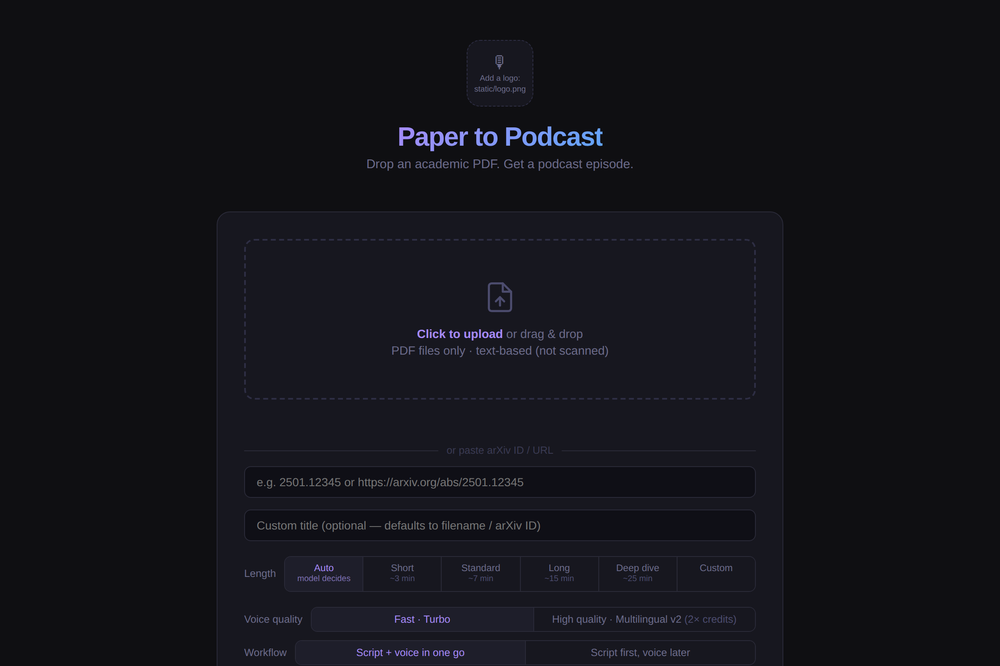
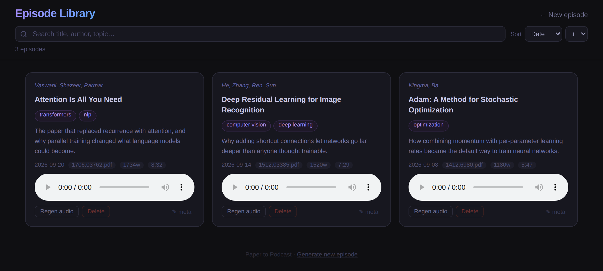

# Paper to Podcast

Upload an academic PDF → get a spoken podcast episode.

Claude reads the paper and writes a spoken script — expert-level analysis, no citations or equations, structured as a narrative argument. You choose the length and which Claude model writes it. ElevenLabs voices the result. If you configure Cloudflare R2, episodes are published to an RSS feed you can subscribe to in any podcast app.



*The upload page: drop a PDF or paste an arXiv ID, then pick the episode length and writing model.*



*The episode library: every generated episode, searchable and playable (sample episodes shown).*

---

## What you need

- **Python 3.10 or newer** (free, from [python.org](https://www.python.org/downloads/)).
- **An [Anthropic API key](https://console.anthropic.com)** — Claude writes the script. Add a few dollars of credit under Billing in the Console first; the key won't work without it. Roughly **$0.05–0.25 per episode**.
- **An [ElevenLabs](https://elevenlabs.io) API key on a paid plan** — it voices the script. The free plan does **not** work: ElevenLabs doesn't allow its Voice Library voices through the API on the free tier, and this app uses the voices in your account. The cheapest paid plan, **Starter (about $6/month, 30,000 credits)**, is enough to get going.
- *(Optional)* A [Cloudflare R2](https://developers.cloudflare.com/r2/) account to publish a podcast feed (the free tier covers most personal use).

### What it costs

Two things cost money: Claude writing the script (cents) and ElevenLabs voicing it (the larger part). ElevenLabs charges per character, and a spoken minute is roughly 900 characters. On the default fast voice (Turbo), Starter's 30,000 monthly credits stretch like this:

| Episode length | Characters | ElevenLabs credits (fast voice) | Episodes per month on Starter |
|---|---|---|---|
| Short (~3 min) | ~2,700 | ~1,350 | ~22 |
| Standard (~7 min) | ~6,300 | ~3,150 | ~9 |
| Long (~15 min) | ~13,500 | ~6,750 | ~4 |
| Deep dive (~25 min) | ~22,500 | ~11,250 | ~2 |

The "High quality" voice option uses about twice the credits, so halve the last column. These are estimates; plans, credit rates and prices change, so check [ElevenLabs pricing](https://elevenlabs.io/pricing) and [Anthropic pricing](https://platform.claude.com/docs/en/about-claude/pricing). Add Claude's cents on top, and a Standard episode costs very roughly a few tens of cents to under a dollar in total. Try a Short episode first.

---

## Quick start (never done this before?)

This takes about 15 minutes. You'll type a few commands into a **terminal**: on a Mac, open the **Terminal** app (press Cmd+Space, type "Terminal"); on Windows, open **PowerShell** (press the Windows key, type "PowerShell"). Type each command and press Enter. Lines starting with `#` are comments, so don't type them.

**1. Check Python.** Run one of these:

```bash
python3 --version     # Mac
py --version          # Windows
```

You need 3.10 or higher. If you get "command not found" or an older number, install Python from [python.org](https://www.python.org/downloads/) (on Windows, tick **"Add python.exe to PATH"** in the installer), then close and reopen the terminal.

**2. Get the code.** Easiest: on this GitHub page click the green **Code** button → **Download ZIP**, unzip it (the folder is called `paper-to-podcast-main`), and move it somewhere you'll find it, such as your Documents folder. Then point the terminal at it:

```bash
cd ~/Documents/paper-to-podcast-main       # Mac (adjust if you put it elsewhere)
cd $HOME\Documents\paper-to-podcast-main  # Windows PowerShell
```

(If you know git, `git clone` works too.)

**3. Create a private Python environment and install the app.** This keeps its packages separate from the rest of your computer.

```bash
# Mac
python3 -m venv .venv
source .venv/bin/activate
pip install -r requirements.txt
```

```powershell
# Windows PowerShell
py -m venv .venv
.venv\Scripts\Activate.ps1
pip install -r requirements.txt
```

You'll see `(.venv)` at the start of your prompt when it's active. If Windows blocks the activate script, run `Set-ExecutionPolicy -Scope CurrentUser RemoteSigned` once and try again.

**4. Get your two API keys** (a key is a long password the app uses to act on your account):

- Anthropic: sign in at [console.anthropic.com](https://console.anthropic.com), add a few dollars under **Billing**, then **API Keys → Create Key**. Copy it straight away; it's only shown once.
- ElevenLabs: you need a paid plan (see above). Then click your profile → **API Keys** → create one.

**5. Put the keys in a settings file.** The settings file is called `.env` (note the dot at the start). Files starting with a dot are hidden in Finder and Explorer, so create and open it from the terminal:

```bash
# Mac
cp .env.example .env
open -e .env
```

```powershell
# Windows PowerShell
copy .env.example .env
notepad .env
```

Replace the two placeholder values with your keys, **with no quotes and no spaces around the `=`**:

```
ANTHROPIC_API_KEY=sk-ant-...your key...
ELEVENLABS_API_KEY=...your key...
```

Save and close. Everything else in the file is optional. Never share this file or post it online.

**6. Start the app.**

```bash
python app.py
```

You should see a line saying `Running on http://127.0.0.1:5050`. Leave this window open, and open [http://localhost:5050](http://localhost:5050) in your browser. If you see a "WARNING: ... API_KEY is not set" line, the `.env` file isn't being picked up: check it's in the same folder as `app.py` and saved.

**7. Make your first episode.** Paste the arXiv ID `1706.03762` (a famous paper), choose **Short**, and press Generate. It takes a minute or two, then you can play it and find it in the library at [http://localhost:5050/library](http://localhost:5050/library).

**To stop the app:** click the terminal window and press Ctrl+C. **Next time:** open a terminal, `cd` into the folder, activate the environment again (`source .venv/bin/activate` on Mac, `.venv\Scripts\Activate.ps1` on Windows), and run `python app.py`.

### If something goes wrong

- **`command not found` / `not recognized`:** Python isn't installed or isn't on your PATH. Reinstall it and tick the PATH option (Windows), then reopen the terminal.
- **`ModuleNotFoundError`:** the environment isn't active. Run the activate command from step 3 and try again.
- **`externally-managed-environment`:** you skipped the environment in step 3. Do it, then `pip install` again.
- **Claude error mentioning credit or authentication:** check your key and that you've added credit in the Anthropic Console.
- **ElevenLabs error, "voice not available", or "no voices":** you're probably on the free plan. Upgrade to a paid plan and generate again.
- **"Address already in use":** another copy of the app is still running. Close its terminal window, or restart your computer.
- **Nothing plays:** open the library page and check the episode is listed; try a different browser if the player is blank.

---

## Setup (for experienced users)

**1. Clone the repo**

```bash
git clone https://github.com/davidmcdougall/paper-to-podcast.git
cd paper-to-podcast
```

**2. Install dependencies**

```bash
pip install -r requirements.txt
```

**3. Configure your environment**

```bash
cp .env.example .env
```

Open `.env` and fill in at minimum:

```
ANTHROPIC_API_KEY=...
ELEVENLABS_API_KEY=...
PODCAST_TITLE=My Research Podcast
```

See `.env.example` for all options with explanations.

**4. Run the server**

```bash
python3 app.py
```

Open [http://localhost:5050](http://localhost:5050). Upload a PDF or paste an arXiv ID and press Generate.

---

## Setting up the podcast feed (optional)

Without R2, audio is stored locally and playable from the web UI at `localhost:5050/library`. With R2, episodes are uploaded and an RSS feed is published — subscribe once in Overcast, Pocket Casts, or Apple Podcasts and new episodes appear automatically.

**1. Create a Cloudflare R2 bucket**

- Go to the [Cloudflare dashboard](https://dash.cloudflare.com) → R2 → Create bucket
- Name it `paper-to-podcast` (or whatever you'd like — just set `R2_BUCKET` to match)
- Under the bucket's **Settings** tab, enable **Public access** and note the public URL (looks like `https://pub-xxxx.r2.dev`)

**2. Create an API token**

- In the R2 section, go to **Manage R2 API Tokens** → Create API Token
- Permissions: **Object Read & Write** scoped to your bucket
- Copy the Account ID, Access Key ID, and Secret Access Key

**3. Add to your `.env`**

```
R2_ACCOUNT_ID=your-cloudflare-account-id
R2_ACCESS_KEY_ID=your-access-key-id
R2_SECRET_KEY=your-secret-key
R2_BUCKET=paper-to-podcast
R2_PUBLIC_URL=https://pub-xxxx.r2.dev
```

**4. Add a podcast logo** *(optional but recommended)*

Podcast apps display artwork. Save a square PNG (3000×3000px recommended) as `static/logo.png` — it also appears in the web UI header. Then publish it to your feed:

```bash
python3 upload_logo.py
```

**5. Subscribe**

Your RSS feed URL is `{R2_PUBLIC_URL}/feed.xml`. Add it to any podcast app as a private/custom feed.

---

## Choosing a voice

By default, Paper to Podcast uses the first voice in your ElevenLabs account. To pick a specific voice:

1. Browse the [ElevenLabs Voice Library](https://elevenlabs.io/voice-library) and add a voice to your account
2. Open the voice in your ElevenLabs dashboard, copy the Voice ID from the URL or settings panel
3. Set `ELEVENLABS_VOICE_ID=<your-voice-id>` in `.env`

---

## Environment variables

| Variable | Required | Description |
|---|---|---|
| `ANTHROPIC_API_KEY` | Yes | From [console.anthropic.com](https://console.anthropic.com) |
| `ELEVENLABS_API_KEY` | Yes | From [elevenlabs.io](https://elevenlabs.io) → Profile → API Keys |
| `PODCAST_TITLE` | No | Your podcast name (default: "Paper to Podcast") |
| `PODCAST_DESCRIPTION` | No | Feed description shown in podcast apps |
| `PODCAST_AUTHOR` | No | Author name shown in podcast apps |
| `ELEVENLABS_VOICE_ID` | No | Leave blank to use first voice in your account |
| `OBSIDIAN_VAULT_PATH` | No | Path to Obsidian vault folder — saves a Zettelkasten note per episode |
| `R2_ACCOUNT_ID` | No | Cloudflare account ID (enables podcast feed) |
| `R2_ACCESS_KEY_ID` | No | R2 API token access key |
| `R2_SECRET_KEY` | No | R2 API token secret |
| `R2_BUCKET` | No | R2 bucket name (default: `paper-to-podcast`) |
| `R2_PUBLIC_URL` | No | R2 public URL, e.g. `https://pub-xxxx.r2.dev` |

---

## Episode length and model

Two controls on the upload page shape each episode:

- **Length** — **Auto** (the default) lets the model size the episode to the paper: a slight paper gets a short episode, a dense one gets a longer treatment. Or force a preset (Short ~3 min, Standard ~7 min, Long ~15 min, Deep dive ~25 min) or **Custom** with a target in minutes (1–40). Longer targets pull in more of the source text, so this also suits book-length inputs.
- **Writing model** — nothing is pinned. On startup the app asks Anthropic's Models API which models your key can use, writes with the newest Sonnet, and uses the newest Haiku for metadata and show notes. The upload page's dropdown lists the newest model of each family (Opus, Sonnet, Haiku and so on), so new releases appear automatically and retired ones disappear. To pin a model, set `TEXT_MODEL` / `FAST_MODEL` in `.env`; to change the dropdown, set `TEXT_MODEL_OPTIONS`; to prefer another family, set `TEXT_MODEL_FAMILY` / `FAST_MODEL_FAMILY`. If the Models API can't be reached and nothing is set, the app falls back to built-in defaults.

---

## Notes

- **Text-based PDFs only.** Scanned or image-based PDFs won't work — no OCR. arXiv papers work perfectly.
- **Cost.** See [What it costs](#what-it-costs). ElevenLabs credits are the main expense; Claude adds cents per episode.
- **Local use only.** The server has no login and binds to `127.0.0.1`. Don't expose port 5050 to a network, and leave `FLASK_DEBUG` unset unless you're developing (debug mode adds an interactive debugger).
- **Optional: transcribing old episodes.** `transcribe_episode.py` needs Whisper: `pip install -r requirements-optional.txt`.
- **Episode library.** Browse all episodes at [http://localhost:5050/library](http://localhost:5050/library).

## Project structure

```
paper-to-podcast/
├── app.py                      # Flask backend (port 5050)
├── templates/
│   ├── index.html              # Upload UI
│   └── library.html            # Episode library
├── static/
│   ├── audio/                  # Generated MP3s (gitignored)
│   └── pdfs/                   # Uploaded source PDFs (gitignored)
├── transcribe_episode.py       # Utility: transcribe existing MP3 → patch episodes.json
├── upload_logo.py              # Utility: upload podcast artwork to R2
├── script-prompt-evaluation.md # Notes on the script-generation prompt
├── requirements.txt
├── requirements-optional.txt   # Whisper, for transcribe_episode.py only
├── .env.example
└── LICENSE
```

## License

MIT — see [LICENSE](LICENSE).
